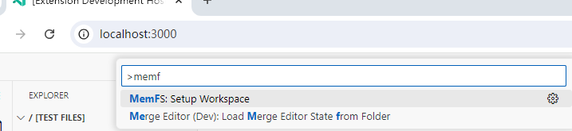
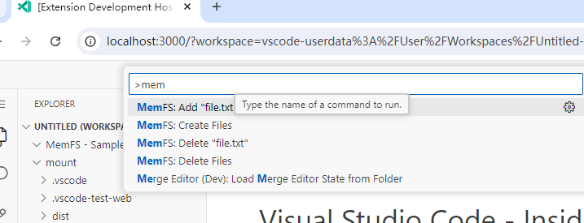
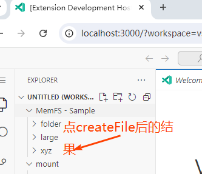

### npm install

### npm run package-web 打包

### 在另外一个终端 
> npm run run-in-browser  这个是在本地起3000 端口 调试   package.json  scripts里定义

### tips:

> package.json 要配 
``` json  
"activationEvents": [
    "onFileSystem:memfs"
  ],
```
### 需要确认下
>  "memfs" 这个值应该和 context.subscriptions.push(vscode.workspace.registerFileSystemProvider('memfs', memFs, { isCaseSensitive: true }));  第一个参数 要保持一致 


### webpack.config.js
- https://webpack.js.org/configuration/resolve/#resolvefallback
  - 官方解释： 
     > Webpack 5 no longer polyfills Node.js core modules automatically which means if you use them in your code running in browsers or alike, you will have to install compatible modules from npm and include them yourself. Here is a list of polyfills webpack has used before webpack 5:
   - 看这个resolve.fallback
   - webExtensionConfig 这个里面 要配置 path，不然引入path会报错
	``` ts
    resolve: {
		mainFields: ['browser', 'module', 'main'], // look for `browser` entry point in imported node modules
		extensions: ['.ts', '.js'], // support ts-files and js-files
		alias: {
			// provides alternate implementation for node module and source files
		},
		fallback: {
			// Webpack 5 no longer polyfills Node.js core modules automatically.
			// see https://webpack.js.org/configuration/resolve/#resolvefallback
			// for the list of Node.js core module polyfills.
			assert: require.resolve('assert'),
			path: require.resolve('path-browserify'),
			buffer: require.resolve('buffer'),
		}
	},
    ```
###
> 然后在弹出的3000端口 
> 按 F1  输入  Memfs ，选择  Setup Workspace
> 然后输入memfs 会看到createFile   addFile（这个目前不能用  会提示Buffer()未定 义）

> createFile 后 就会 多了三个文件夹  folder   larger 和xyz
> 代码在 extension.ts  memfs.init这个command



